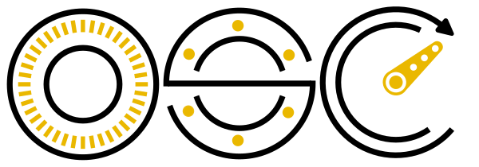

<p align="center">
  
</p>

# OpenServoCore

> The definitive open platform for turning cheap servos into smart actuators.

OpenServoCore (OSC) is open hardware and firmware that drops a CH32V006 control board into a $2-3 cloned hobby servo (SG90 and friends) and turns it into a DXL-style smart actuator — position feedback, current sensing, bus-addressable, programmable.

The thesis is the price point: at mass-production volume, an OSC swap board should add **no more than ~$1 to the BOM** of a cloned servo. Cheap enough that "upgrade every servo in a robot to smart" stops being a premium decision and starts being a default.

## Status

🚧 **In active development. Nothing here is shippable yet.** The firmware is being rewritten, the dev board is routed and awaiting fab, and the swap board is designed but not spun.

- 🟡 **OSC Dev CH32** (`osc-dev-v006`) — routed, docs ready, awaiting fab.
- 🔭 **OSC SG90 CH32** (`sg90-prod-ch32v006`) — designed, not spun. Waiting on firmware v2 to be testable against.
- ⚠️ **Firmware v1** (`firmware-old/`) — legacy. First pass was vibe-coded and got poor Reddit feedback. Kept as historical reference; **not a target for new work**.
- 🔭 **Firmware v2** (rewrite) — not started. Architecture doc next; first module (transport or register table) is the Q2 milestone.
- ✅ **tinyboot** (OSC bootloader) — v0.4.0 shipped. Lives at [`OpenServoCore/tinyboot`](https://github.com/OpenServoCore/tinyboot).

## Repo map

```
open-servo-core/
├── hardware/
│   ├── boards/
│   │   ├── osc-dev-v006/             # OSC Dev CH32 — has its own README with pinouts, jumpers, bringup notes
│   │   ├── sg90-prod-ch32v006/       # OSC SG90 CH32 swap board (designed, not spun)
│   │   ├── servo-dev-board-stm32f301/# Retired hobby-phase STM32 dev board (legacy)
│   │   ├── encoder-board/            # Optional quadrature encoder breakout for J8 experiments
│   │   └── motor-mount/              # 3D-printable test fixtures
│   ├── shared.kicad_sym / shared.pretty / shared.3dshapes  # Shared KiCad libraries
│   └── templates/                    # KiCad project templates
├── firmware/                         # Firmware v2 lives here once the rewrite starts
└── firmware-old/                     # Legacy firmware (do not use)
```

The OSC bootloader, [`tinyboot`](https://github.com/OpenServoCore/tinyboot), is a separate repo. It's part of the OSC firmware stack but versioned and released independently — its chip-support matrix (V003 / V00x / V103) is broader than the OSC boards on purpose.

## Naming

OSC boards follow `OSC <Form> <ChipFamily>`:

- **OSC Dev CH32** — dev board, exposes every rail and signal for firmware bringup. Directory: `osc-dev-v006`.
- **OSC SG90 CH32** — swap board that physically replaces the SG90 factory PCB. Directory: `sg90-prod-ch32v006`.

Engineering SKUs (`osc-<form>-<chip>-rev-<letter>`) appear in BOMs and schematic title blocks; the names above are what you'll see in posts and docs.

## Hardware

OSC standardizes on the **CH32V006** — 48 MHz RISC-V, 62 KB flash, 8 KB RAM. Chosen because it's the chip that makes the ≤$1 BOM uplift work. No multi-chip roadmap; one chip, done well.

Each board has its own README with full schematics, pinouts, jumper behaviour, and bringup notes:

- **[OSC Dev CH32](hardware/boards/osc-dev-v006/README.md)** — accepts any gutted hobby servo, USB-C / 1S-2S LiPo / WCH-LinkE power, full edge test-point fanout. Routed, awaiting fab.
- **[OSC SG90 CH32](hardware/boards/sg90-prod-ch32v006/README.md)** — compact swap board, 10×12.5 mm, double-sided. Designed; not yet spun.

## Firmware

The Rust firmware is mid-rewrite. The legacy `firmware-old/` tree contains the original architecture (multi-crate workspace targeting STM32F301 and partly CH32V003) and is kept for reference, but the v2 rewrite starts from a cleaner architecture targeting CH32V006 first. Plan: DXL-compatible register table, persistence, control loops, safety features. Estimated 3+ months once it begins.

When firmware v2 starts landing, build instructions will appear here.

## Contributing

This is early — the most useful thing right now is **following along and asking questions**, not opening PRs.

- **Discussions:** [github.com/OpenServoCore/open-servo-core/discussions](https://github.com/OpenServoCore/open-servo-core/discussions) — design questions, ideas, "is this on the roadmap?" go here.
- **Build journey:** posts at [aaronqian.com](https://aaronqian.com) document the design decisions, dead ends, and what shipped each week.
- **Issues:** open ones on this repo are scoped to specific work (README, LICENSE, board revisions). Pre-firmware-v2, contributor scope is small.

Hardware sponsorship for the dev boards comes from **PCBWay**.

## License

OSC is fully open. No dual licensing, no commercial gates.

- **Firmware** — [MIT](LICENSE-MIT) **OR** [Apache-2.0](LICENSE-APACHE), at your option (Rust ecosystem convention).
- **Hardware** (schematics, layouts, board files) — [CERN-OHL-P v2.0](LICENSE-HARDWARE).
