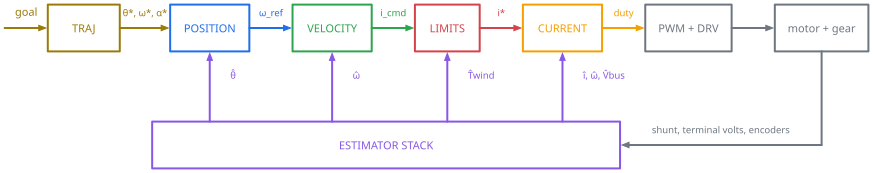
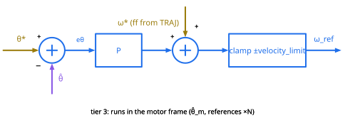
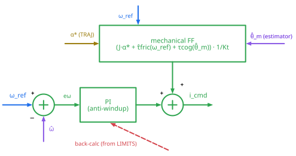
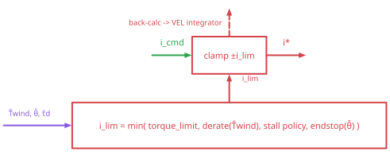
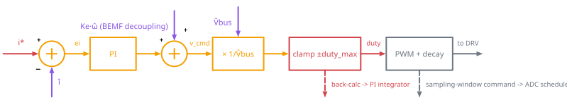
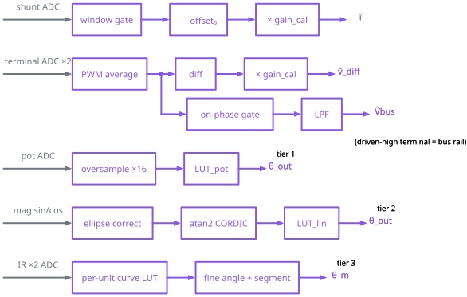
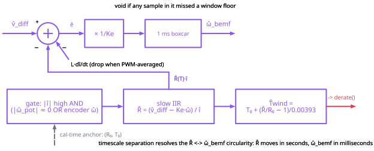
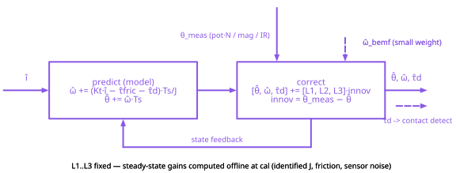
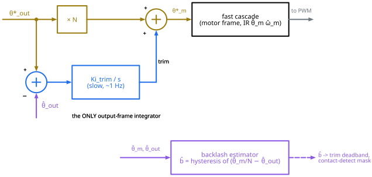
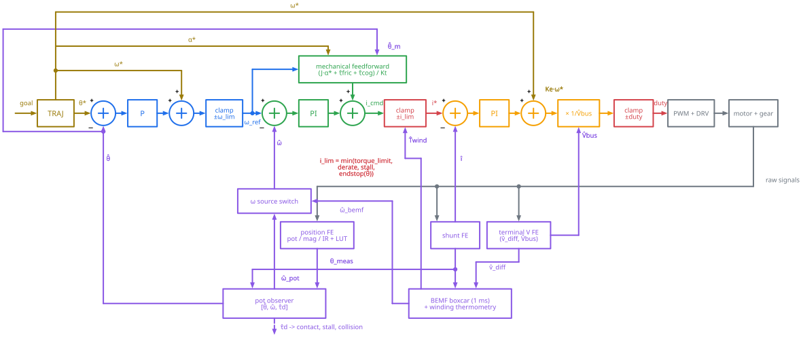

# Control Theory

This document is the control theory behind the OSC servo firmware, written ahead of the implementation so the code has something to be checked against. It is self contained. No control background is required beyond a rough idea of what a PID loop is.

The short version: a classic three-loop cascade, a current loop inside a velocity loop inside a position loop, plus an estimator layer that turns whatever sensors are present into estimates of position, velocity, torque, and temperature. Better sensors upgrade the estimates. The loops themselves never change.

Notation first. A star means a target ($\theta^{\ast}$), a hat means an estimate ($\hat\theta$). Subscript $m$ is the motor shaft, subscript $\text{out}$ is the output shaft after the gearbox.

## Where This Design Comes From

Before diving in, I want to be honest about where this design comes from. It is built on the inspirational work of Adam Bäckström's [ServoProject](https://github.com/adamb314/ServoProject), design sessions with Claude (Anthropic's Fable 5 model), and my own limited understanding of control theory. I'm not a professional embedded developer or a control theory guy. I did CE/EE in school and took some basic control theory courses, and that was enough to drive parts of this design, but only to a limited degree.

So if you see any issues or errors in the design, or would like to contribute ideas, feel free to leave a message on the [discussion board](https://github.com/OpenServoCore/open-servo-core/discussions). I'd love to hear your thoughts.

## The Plant

The thing being controlled is a brushed DC motor driving a gearbox. Three equations describe pretty much all of it:

$$v = R(T)\cdot i + L\cdot \frac{di}{dt} + K_e\cdot \omega_m \qquad (1)$$

$$K_t\cdot i = J\cdot \frac{d\omega_m}{dt} + \tau_f(\omega_m) + \tau_\text{load} \qquad (2)$$

$$\theta_\text{out} \approx \theta_m / N \qquad (3)$$

Equation (1) is the motor's electrical equation, the voltage across its terminals. The voltage splits three ways. Some is burned in the winding resistance $R$, some goes into the winding inductance $L$ while current is changing, and the rest fights the back-EMF $K_e\cdot \omega_m$. Back-EMF is the voltage the motor generates just by spinning. It is proportional to speed, and $K_e$ is the proportionality constant.

Equation (2) is the mechanical equation, Newton's second law for the rotor. Current makes torque, $\tau = K_t\cdot i$, and the torque splits three ways just like the voltage. Some goes into accelerating the rotor inertia $J$, some is eaten by friction, and the rest pushes whatever load is on the shaft.

Equation (3) is the gearbox. It divides the motor angle by the gear ratio $N$. The $\approx$ is hiding backlash. Backlash is the slop between gear teeth, so the output can wiggle a little without the motor moving, and the two angles disagree by up to the slop width depending on which direction was driven last.

A neat fact: $K_e$ and $K_t$ are the same number in SI units. Measure one and you have the other.

Two details in there do a lot of work later. First, $R$ depends on temperature. Copper gains about 0.393% resistance per °C, so a motor that heats up 40 °C is a motor whose resistance grew by about 16%. Second, friction in a cheap gearmotor is big, mostly Coulomb friction (a constant drag that flips sign with direction) plus a viscous term:

$$\tau_f(\omega) = \tau_c\cdot \text{sign}(\omega) + b\cdot \omega$$

## Why a Cascade

You could control position with one big PID straight from position error to PWM duty. That is basically what a stock hobby servo does, and it works, sort of. The problem is that one loop has to deal with three very different kinds of physics at once. Electrical dynamics settle in microseconds, velocity in milliseconds, position in tens of milliseconds. One set of gains cannot be tight on all three at the same time, so it ends up loose on all of them.

The cascade splits the job into nested loops, fastest on the inside:

- The **current loop** runs at the PWM rate. Current is torque, so this is really the torque loop.
- The **velocity loop** runs about ten times slower and commands current.
- The **position loop** runs at a similar or slower rate and commands velocity.

Each loop only has to handle one kind of physics, and each loop makes the plant look simpler to the loop outside it. By the time the position loop is involved, "apply a torque" is just a number it writes, and all the electrical mess is somebody else's problem.

The cascade also gives you limits for free. Clamp the command between two loops and you have a real physical limit. Clamp the current command and you have a torque limit. Clamp the velocity command and you have a speed limit. No special cases inside the loops.

One more rule, but it needs some background before I state it.

A P controller alone cannot hold against a constant load. Its output is proportional to error, so to keep putting out torque it must keep a standing error. Picture a servo horn holding a weight: with pure P the arm sags below the target forever, because sitting exactly on target would mean zero error and therefore zero torque. The fix is the I in PI. An integrator accumulates error over time and keeps nudging the output until the error is exactly zero, then holds the accumulated value as a standing command. It is the loop's memory.

Memory has a failure mode. When the output hits a limit, the error persists, and the integrator keeps charging up a correction it cannot deliver. When the limit releases, all that stored correction dumps out and the servo overshoots while the integrator drains back down. This is called windup, and the standard cure is back-calculation anti-windup: whenever the output clips, the clipped amount is fed back to discharge the integrator, so it never charges past what the output can actually deliver.

The second problem shows up when two nested loops both have memory. Suppose the position loop and the velocity loop each carried an integrator, and the servo sits slightly off target. Both integrators see the same standing error, one directly and one through the cascade, and both charge up to remove it. The same correction gets applied twice, the servo overshoots, both integrators start draining, it undershoots, and the result is a slow hunt around the target that no amount of gain tuning fixes cleanly.

Thus the rule: each frequency band gets at most one integrator, and every integrator gets anti-windup. In this design the current PI and the velocity PI carry the integral action, and the position loop stays pure P.

## The Trajectory Generator

Targets don't go straight into the position loop. A trajectory generator sits in front and turns a step in `goal_position` into a smooth motion profile, capped by a velocity and acceleration limit. It emits three signals at once: the position reference $\theta^{\ast}$, the velocity along the profile $\omega^{\ast}$, and the acceleration along the profile $\alpha^{\ast}$.

The last two are feedforward. Feedforward means telling the loops what is about to be needed instead of waiting for them to notice the error. If the profile says "we should be moving at 2 rad/s right now", the velocity loop gets that directly and only has to correct the small difference. This is what lets the feedback gains stay modest. Low gains ride through sensor noise, and the feedforward does the actual work of following the profile.

The target can also enter further in. Velocity mode feeds $\omega^{\ast}$ straight to the velocity loop, and torque mode feeds a current target straight to the limiter.

Before any shaping happens, the goal itself is clamped against the control table's position limits. Not every servo can swing a full turn, and a robot may add tighter mechanical limits of its own on top. Clamping at the entry works nicely with the profile: since the profile respects the acceleration limit, a goal clamped at the wall decelerates into the wall instead of slamming the reference against it. The clamp here handles the normal case only. The safety net for overshoot and external forces is the endstop term in the limits block below.

## The Position Loop

Pure proportional. Position error times $K_p$ gives a velocity command, add the $\omega^{\ast}$ feedforward, clamp to `velocity_limit`, done. No integrator here (see the rule above). Steady-state accuracy comes from the velocity loop's integrator and the feedforward. Besides, a position integrator on top of Coulomb friction is a classic recipe for limit cycling, where the servo slowly hunts back and forth around the target forever.

## The Velocity Loop

A PI controller plus feedforward of everything the mechanical model already knows:

- $J\cdot \alpha^{\ast}$, the torque needed to accelerate along the profile.
- $\tau_f(\omega^{\ast})$, the friction model evaluated at the profile velocity.
- $\tau_\text{cog}(\hat\theta_m)$, a small position-dependent torque ripple map.

This block is the mechanical half of the motor model run backwards, from the motion I want to the torque it takes. (The electrical half of the model shows up later, as the current loop's decoupling terms.) Its inputs come from three different places: $\alpha^{\ast}$ from the trajectory generator, $\omega_\text{ref}$ from the position loop's output, and $\hat\theta_m$ from the estimator layer.

All three are divided by $K_t$ to become a current command. The friction term matters the most. On a gearmotor the Coulomb term dominates, and feeding it forward is the difference between tight low-speed tracking and tracking that feels like molasses. The PI then only cleans up what the model missed.

The integrator uses back-calculation anti-windup. When the limiter downstream clips the command, the difference is fed back to shrink the integrator, so it never charges up against a limit it cannot push through.

## Limits

The current clamp is the one choke point every command passes through, so it is where all protection lives. The limit `i_lim` is the minimum of four terms, and each one is doing a different job:

- **`torque_limit`** protects the gear train. This is the tooth saver on a plastic-geared servo, and the yield behavior comes for free. Push the output harder than the limit and the servo cannot fight back harder than $K_t \cdot i_\text{lim}$, so it gives way while the position error grows. Let go and the error is still standing there, so it pulls right back. No special mode needed, that is just what a saturated cascade does. A stock servo strips teeth exactly because it has no current loop, a stall there means maximum current for as long as the fight lasts.
- **`derate(T̂wind)`** protects the copper. It is a foldback curve. Below a threshold temperature it does nothing, above it the ceiling ramps down, reaching zero at the absolute max. The nice part is that this self-regulates. Less allowed current means less heating, so the servo settles at a thermal equilibrium of "weaker but still holding" instead of banging on and off. A hard cutoff plus an alert flag sits at the absolute max as a last resort, and the ramp should keep it from ever being reached.
- **stall policy** covers the losing fight. Current pinned at the limit with $\hat\omega \approx 0$ (equivalently, a large steady $\hat\tau_d$) means the servo is stalled against something. After a timeout the limit folds to a lower yield torque so it stops cooking itself, and restores when $\hat\tau_d$ relaxes. A $\hat\tau_d$ spike counts too: a collision detected by the fusion filter can drop the limit within one control cycle, which is what protects the teeth from shock loads rather than static ones.
- **`endstop(θ̂)`** enforces position limits, the other half of the goal clamp in the trajectory generator. It is directional: when $\hat\theta$ sits at or past a limit, current pushing further in gets clamped toward zero while current pulling back out stays allowed. The servo can always retreat from a wall and never gets stuck fighting itself, and the protection holds even when overshoot or an external force carried it past the limit with a perfectly legal reference.

Whatever clips here back-propagates to the velocity integrator as described above.

## The Current Loop

A PI plus two corrections that make its life much easier.

First, back-EMF decoupling. The motor generates $K_e\cdot \hat\omega$ volts on its own, so that gets added to the PI output as feedforward. Without it, the loop has to fight the back-EMF with its integrator, and its effective bandwidth collapses as the motor speeds up. With it, the PI only handles the $R\cdot i + L\cdot di/dt$ part, which does not care about speed.

Second, supply-voltage compensation. The loop computes a voltage command, but the output is a PWM duty cycle, and duty times supply voltage is the actual applied voltage. Dividing the command by $\hat V_\text{bus}$ makes the loop gain independent of a sagging battery. (There is no divide in the hot path. A reciprocal lookup plus one Newton iteration does the trick.)

There is also a third piece, an explicit duty clamp at ±`duty_max`. Physically that clamp exists whether or not it is written down, duty cannot exceed 100%. Writing it down matters for two reasons. In order to keep the one-integrator rule honest, the saturation has to back-calculate into the current PI, otherwise a sagging battery at high speed winds up the integrator against voltage that is not there. And `duty_max` probably sits a little below 100%, because the shunt is only visible during part of the PWM cycle and the sampling window has to survive at every operating point.

One measurement subtlety worth calling out. With a single low-side shunt, motor current only flows through the shunt during part of the PWM cycle. During slow-decay recirculation, the current loops around inside the bridge and the shunt sees nothing. So current sampling has to be synchronized to the PWM and aimed at the window where the current is actually visible. Which windows those are depends on the bridge's decay mode.

## The Estimator Layer

The loops above consume $\hat\theta$, $\hat\omega$, $\hat i$, $\hat T$, and $\hat V_\text{bus}$. The estimator layer produces them from whatever sensors exist. Let's take a look at the front ends first:

The philosophy across the board is cheap sensor, big per-unit calibration table. A potentiometer with a lookup table gives around 9 usable bits. A sin/cos magnetic sensor plus an ellipse fit (correcting offset, amplitude, and phase of the two channels), an `atan2`, and another lookup table gives 12 to 14 bits. A pair of IR reflectance sensors reading the motor shaft is only usable at all because of its per-unit calibration curve. In every case the money goes into the calibration data instead of the sensor.

The `atan2` runs as a CORDIC, which is an iterative shift-and-add algorithm that computes angles with no multiply or divide. Handy on small chips.

One detail worth pointing out. There is no separate supply divider. When the bridge drives a motor terminal high, that terminal is sitting at the bus rail, so sampling the terminal sense at the right PWM phase measures the supply. $\hat V_\text{bus}$ comes out of the same two dividers as $\hat v_\text{diff}$.

### Back-EMF, a Velocity Sensor for Free

Rearrange the electrical equation and the motor is its own tachometer:

$$\hat\omega_\text{bemf} = \frac{\hat v_\text{diff} - \hat R(T)\cdot \hat i}{K_e}$$

where $\hat v_\text{diff}$ is the measured voltage across the motor terminals, averaged over a PWM period (averaging is also what lets me drop the $L\cdot di/dt$ term). No encoder anywhere, and it is good enough to close the velocity loop on.

But look at the error budget. The estimate subtracts $\hat R\cdot \hat i$, and I said earlier that $R$ moves 16% over a 40 °C warmup. At high current and low speed, that error term is as big as the back-EMF itself, and the estimate turns into garbage exactly when the motor is working hard. So this observer is only honest if something tracks $R$ as the motor heats up. Which brings us to the next block.

### The Winding as a Thermometer

The same equation flipped around gives resistance instead of speed. When the motor is holding still (or the speed is known from an encoder), the back-EMF term is known, and

$$\hat R = \frac{\hat v_\text{diff} - K_e\cdot \hat\omega}{\hat i}$$

Feed that through a slow filter and copper's temperature coefficient turns it into a winding temperature:

$$\hat T = T_0 + \frac{\hat R / R_0 - 1}{0.00393}$$

The $(R_0, T_0)$ anchor comes from calibration. With the motor cold, the servo measures $R_0$ on its own, and the ambient temperature is the one number the user types in by hand, a thermostat glance is accurate enough. The pair is stored in flash, so it survives reboots, and there is deliberately no re-anchoring at boot: a hot reboot would record a warm winding as ambient and bias the whole estimate low. With a sensing chain good to about 1% and a roughly right room temperature, this lands within a few °C, and it measures the copper itself, which is exactly the thing that needs protecting, instead of some spot on the case.

You might have noticed the circularity. $\hat\omega_\text{bemf}$ needs $\hat R$, and $\hat R$ needs $\hat\omega$. The fix is timescale separation. The $\hat R$ update only runs when a gate allows it (high current, plus near-zero or encoder-confirmed speed) and moves over seconds, while $\hat\omega_\text{bemf}$ moves in milliseconds. Each one is effectively constant from the other one's point of view.

### The Fusion Filter

Position and velocity estimates come from a small Kalman filter over three states, $[\hat\theta_m,\ \hat\omega_m,\ \hat\tau_d]$. Every cycle it does two steps. Predict pushes the states forward using the mechanical model:

$$\hat\omega \leftarrow \hat\omega + (K_t\cdot \hat i - \hat\tau_f - \hat\tau_d)\cdot \frac{T_s}{J} \qquad \hat\theta \leftarrow \hat\theta + \hat\omega\cdot T_s$$

Correct compares the predicted position against the measured one and nudges all three states by fixed gains:

$$e = \theta_\text{meas} - \hat\theta \qquad \hat\theta \leftarrow \hat\theta + L_1\cdot e \qquad \hat\omega \leftarrow \hat\omega + L_2\cdot e \qquad \hat\tau_d \leftarrow \hat\tau_d + L_3\cdot e$$

A textbook Kalman filter recomputes its gains every cycle with matrix math. For a plant like this, those gains converge to constants, so they can be computed once offline (from the identified inertia, friction, and sensor noise) and baked in. At runtime the whole filter is a handful of multiply-adds.

The third state $\hat\tau_d$ is the fun one. It is the disturbance torque, the torque the model cannot explain. In other words, it is an estimate of the external load on the shaft. Contact detection and collision stopping fall out of it basically for free.

The measurement source is whatever the best position sensor is, with $\hat\omega_\text{bemf}$ blended in at a small weight. Swapping sensors swaps the measurement source and the gain set, and nothing else.

## Dual Encoders

With an encoder on the motor shaft and another on the output shaft, something nice becomes possible. The motor-shaft encoder sees everything multiplied by the gear ratio, so per output degree it has $N$ times the resolution. In order to get the smoothest control, the whole fast cascade runs in the motor frame on that signal.

But the motor frame cannot know where the output actually is, because the gearbox sits in between with its backlash and tooth error. So the output encoder closes one very slow integrator (around 1 Hz) that trims the motor-frame target until the output lands where it should. The gearbox error never enters the fast loops at all. It just gets absorbed by the slow trim. This trim integrator is the single output-frame integrator allowed by the rule from earlier.

As a bonus, the difference $\hat\theta_m/N - \hat\theta_\text{out}$ traced across direction reversals is a direct measurement of the backlash width. That sets the trim deadband, and it also masks false contact detections during reversals, since crossing the backlash gap looks a lot like hitting something.

This two-encoder scheme is the heart of Adam Bäckström's [ServoProject](https://github.com/adamb314/ServoProject), which is where I learned it.

## Sensing Tiers

The same cascade runs against three sensor configurations. Each addition upgrades some estimates and touches nothing else. The main board routes two two-channel analog inputs, a position pair on the output side and an encoder pair at the motor, so the tiers stay additive: you upgrade the sensors, you never respin the board.

- **Tier 1: main board only.** The shunt, the two terminal dividers, and the servo's stock potentiometer on one channel of the position pair. No extra parts. This is the baseline build, and it already runs the full cascade.
- **Tier 2: output encoder coupon.** A tiny board soldered onto the same pot legs. The gutted pot stays on as the shaft bearing, a small diametral magnet rides the shaft, and an SC4251 sin/cos Hall sensor feeds both channels of the position pair. Absolute output angle, continuous rotation, and no wiper left to wear out. I plan to design a proper mechanical housing for the shaft and magnet later. For now the gutted pot does the job at the experimental stage.
- **Tier 3: motor encoder flex.** A flex PCB tucked under the motor. Two reflective IR sensors (ITR1204 class) read a printed pattern disc on the motor pinion and feed the encoder pair. This is the motor-shaft encoder that unlocks the dual-encoder structure above.

| quantity | I/V sensing + pot | + output magnetic encoder | + motor-shaft encoder |
|---|---|---|---|
| $\hat i$ (torque) | shunt | same | same |
| $\hat\theta_\text{out}$ | pot + LUT, ~9 bits | 12-14 bits absolute | magnetic, trimmed |
| $\hat\theta_m$ | $\theta_\text{out}\cdot N$, implied | same | measured directly |
| $\hat\omega$ | back-EMF observer | encoder + back-EMF fusion | motor encoder |
| $\hat T$ winding | $R = V/I$ thermometry | same | same |

The first column is the one I find elegant. Precise current and voltage sensing alone, with no encoder beyond the stock pot, already carries a full cascade: torque from the shunt, velocity from the back-EMF observer, temperature from the winding resistance. The other two columns refine position and velocity, they don't add any new loop.

## Calibration

Almost every block above leans on per-unit calibration data: the pot linearization table, the sin/cos ellipse fit, the IR curve, $K_e$, the $(R_0, T_0)$ anchor, the friction and cogging maps, the measured gear ratio, and the fusion gains.

I haven't designed the calibration procedure yet. It will probably become its own document and get linked from here. But the goal is already clear: you should be able to calibrate a servo with no special equipment. The servo spins its own motor, measures with its own sensors, fits the curves, and stores the results. The one thing it cannot measure is the room temperature, so it asks. It also waits for the winding resistance to stop drifting before it anchors, so a freshly driven motor cannot poison the anchor while still warm.

This is actually part of the reason the precision current and voltage sensing is there in the first place. Without it, calibration means system identification: you drive the motor with test signals and fit one big lumped model of everything between PWM duty and motion, with the bridge nonlinearity, $R$, $K_e$, and friction all tangled together. (ServoProject does exactly this, and does it well, because its hardware only measures position.) With current, voltage, and temperature sensing, most of that model turns into stuff you can just measure. $R$ is $V/I$ with the motor held still. For $K_e$, let the motor coast, the terminal voltage is pure back-EMF, so divide it by speed. $K_t$ is the same number as $K_e$, so now torque is known too, without ever needing a torque rig. The bridge nonlinearity doesn't need a model at all, the current loop regulates measured current right through it. In the end the only things left to fit are the mechanical ones, $J$ plus the friction and cogging maps, and those come from applying known torques and watching what the motion does. Basically, the motor is transparent under current, voltage, and temperature sensing.

## Putting It All Together

Here is the whole design in one picture, every block from the previous sections wired together:

Two notes reading it. The `i_lim` block keeps its `min()` inputs folded in, the full detail is in the limits section. And this is the single-encoder arrangement. For the dual-encoder configuration, the position reference side gets wrapped with the ×N and trim blocks from the dual encoders section, and the fast loops move to the motor frame.

## Caveats

- The back-EMF observer is weakest at low speed and high current, which is unfortunately also where a servo spends a lot of its life. The winding thermometer recovers most of it, but the floor of this approach is set by how well $\hat R\cdot \hat i$ can be subtracted, and I don't expect miracles near stall. In the encoder-less configuration, that is the price of admission.
- The fusion filter is a tradeoff forced by the dirt cheap MCU. A fancier filter would re-estimate the inertia as the load changes, but this chip has no room for matrix math, so the gains are baked offline from one identified $J$. What gets sacrificed is $\hat\tau_d$ during hard acceleration: when the real inertia is off from the identified one, the unexplained acceleration shows up as phantom external torque. Position and velocity stay honest, the correct step keeps re-anchoring them to real measurements, and a wrong $J$ costs nothing at steady speed because inertia only enters through acceleration. I think this is good enough, and if the bench says otherwise the fixes are incremental: calibrate $J$ with the real load attached, or mask contact detection while $|\alpha^{\ast}|$ is large. For what it's worth, ServoProject made the same call on the same class of chip: its Kalman filter also runs fixed gains computed offline, with no matrix math in the loop.
- The $(R_0, T_0)$ anchor ages with the brushes. Contact resistance drifts over the motor's life, which slowly biases the absolute winding temperature. Re-running calibration once in a while resets it, and calibration costs nothing.
- The shunt sampling windows depend on the bridge's decay behavior, and getting them wrong silently corrupts $\hat i$, which then poisons the observer and the thermometer downstream. This one deserves paranoia.

If you made it this far and can poke a hole in any of this, please do. The invitation from the top of the doc stands: open a [discussion](https://github.com/OpenServoCore/open-servo-core/discussions), I'd love to hear it.
