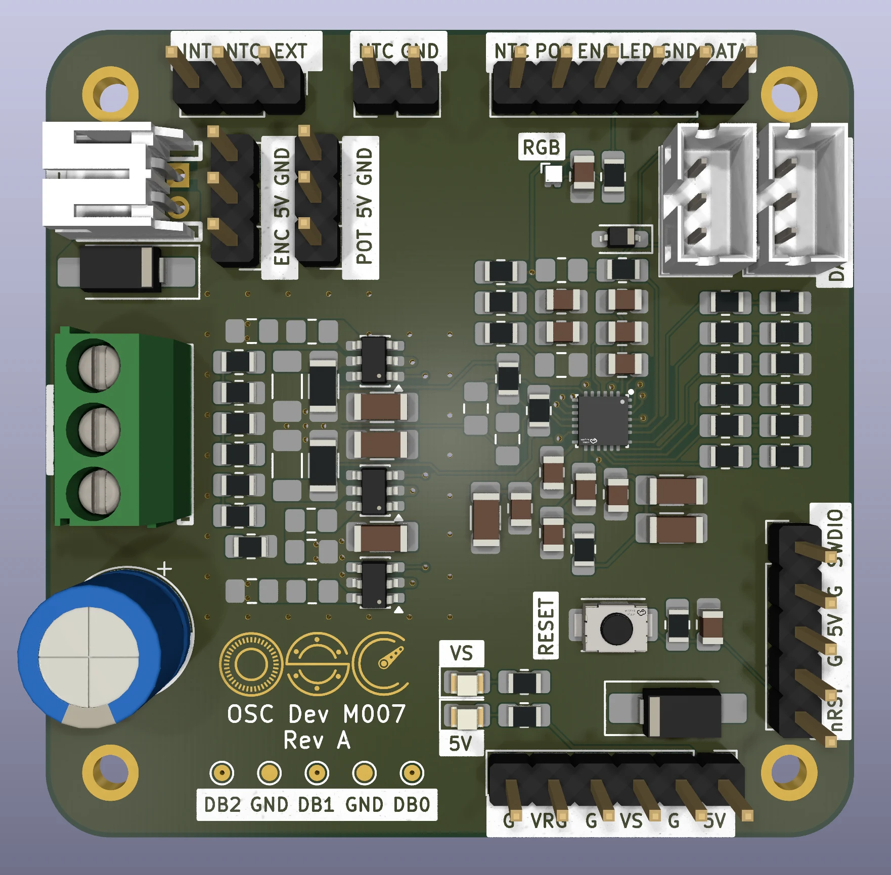
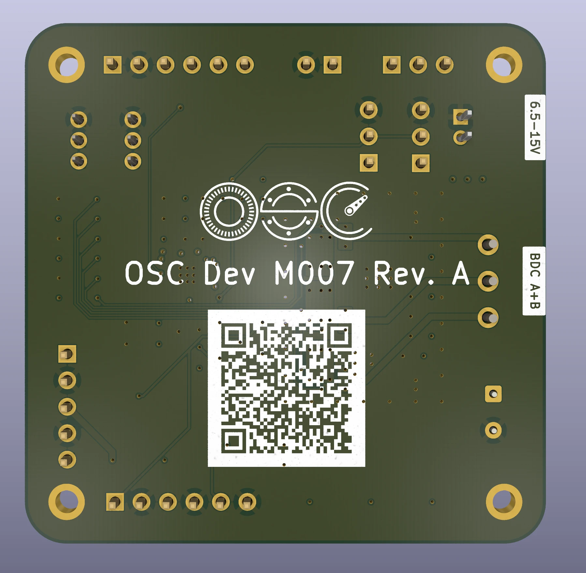

# OSC Dev M007 - Rev A

> ⚠️ **Designed, not fabricated yet.**
> No physical copy of this board has been built or tested. Everything below is design intent, written before the first article. If you fab one before that happens, you are the test pilot.

The development board for OpenServoCore's M007 servo brain. One chip - the CH32M007, 3 × 3 mm - contains the microcontroller, the motor gate driver, the current-sense amplifier, and the 5 V regulator. Add six small MOSFETs and it drives a brushed servo motor (SG90/MG90 class) or a small 3-phase BLDC, measures motor current, reads a position sensor, and talks on a single-wire bus.

This is the bench version: everything on a labelled connector or test point, screw terminals for the motor, room to probe. The matching production board ([osc-sg90-m007](../osc-sg90-m007/)) squeezes the same circuit into an SG90 case; this one spreads it out on 50 × 50 mm so it is easy to work on.

## What you need

- **Power between 6.5 and 15 V** - a 2S or 3S LiPo, or a bench supply.
- A **WCH-LinkE** debug probe (about $4) to flash firmware and read logs.
- Something to move: a gutted hobby servo (motor + potentiometer), a bare DC motor, or a small gimbal-class BLDC.

## Board tour

Every connector is labelled on the silkscreen:

| Silk label | What it is |
| --- | --- |
| `+` `-` (JST, top left) | Battery input, 6.5-15 V, reverse-polarity protected |
| `A B C` (screw terminal) | Motor. Brushed motor uses A and B; BLDC uses all three |
| `DATA VS GND` (two JSTs) | The servo bus. Two jacks so boards daisy-chain; `VS` is the raw supply rail |
| `POT 5V GND` | Servo potentiometer (wiper to `POT`) |
| `ENC 5V GND` | Encoder input - analog voltage, or PWM like an AS5600 |
| `INT NTC EXT` | Temperature source jumper: onboard sensor (`INT`) or your own thermistor on the `NTC GND` header (`EXT`) |
| `SWDIO G 5V G RST` | Debug/flash header for the WCH-LinkE |
| `G VRG G VS G 5V` | Power-rail probe header, every second pin is ground |
| `NTC POS ENC LED GND DATA` | Signal breakout for a scope or logic analyzer |
| `DB0` `DB1` `DB2` + `GND` | Firmware timing probe pads |
| `RGB` | WS2812 status LED |
| `VS` / `5V` LEDs | Power indicators: motor rail / logic rail |
| `RESET` | Reset button |

## Powering it

Three ways in, and they can be combined freely:

1. **Battery jack** - 2S or 3S LiPo. This input has a protection diode, so a reversed pack does nothing instead of damage. The diode costs ~0.4 V, so a nearly-empty 2S may dip under the motor's 6.5 V floor a little early.
2. **Bus jack `VS` pin** - wired straight to the rail, no diode. This is how a servo receives power in a robot, and the better path for high-current bench work.
3. **The LinkE's 5 V** through the debug header - powers the logic only.

The one rule to internalize: **the motor only runs above about 6.5 V.** The gate driver refuses to switch below that - a built-in safety property, not a fault. In practice:

- On 5 V from the LinkE, everything except the motor works: the MCU boots, firmware flashes, the bus talks, sensors read. **A dark motor on USB-level power is normal, not a broken board.**
- A 1S battery (4.2 V) can never drive the motor. 2S minimum.

The FETs are sized for roughly 2 A continuous and 3 A bursts - enough for every SG90/MG90/MG996R-class servo. A hardware comparator cuts the bridge at about 2.5-2.75 A on its own, even if firmware hangs.

## Hooking up a servo

The core experiment - turning a $2 servo into a smart one:

1. Open the servo and unsolder its factory PCB.
2. Motor wires → screw terminals `A` and `B`.
3. Potentiometer → the `POT 5V GND` header, wiper to `POT`.
4. Power and bus → one of the JST bus jacks.

The board measures motor current through two small shunt resistors and the chip's built-in amplifier - about 1 mA per ADC count - so firmware can feel load and stall without any extra parts.

For temperature, the onboard sensor (`INT` jumper) tracks the board. For motor experiments, tape a 10 k NTC thermistor to the motor can, wire it to `NTC GND`, and move the jumper to `EXT`.

## Talking to it

The bus is one shared 5 V wire plus power and ground. Every servo hangs on the same three wires, each with its own address, at up to 3 Mbaud. The wire format is the [osc-native protocol](../../../docs/osc-native-protocol.md) - OSC's own break-framed protocol, in the spirit of Dynamixel but designed for very cheap MCUs.

On the host side, a second WCH-LinkE flashed with the [adapter firmware](../../../firmware/boards/osc-adapter-wchlinke/) becomes the USB-to-bus interface.

## Flashing firmware

Connect a WCH-LinkE to the debug header - `SWDIO` and `G` at minimum, plus `5V` if the probe should power the board - and flash with [wlink](https://github.com/ch32-rs/wlink). Firmware v2 for the M007 is in bring-up; the transport and protocol layers are proven on the V006 family and the M007 uses the same USART hardware. Check the repo root [README](../../../README.md) for current status.

## Specs

| | |
| --- | --- |
| Brain | CH32M007E8U7 - 48 MHz RISC-V MCU + gate driver + current-sense amp + 5 V regulator, one QFN-26 |
| Supply | 6.5-15 V (2S/3S LiPo) |
| Motor | Brushed H-bridge or 3-phase BLDC, ~2 A continuous / 3 A burst |
| Current sense | Two 75 mΩ shunts, on-die amplifier, ~1 mA resolution |
| Overcurrent | Hardware comparator trip at ~2.5-2.75 A |
| Feedback | Potentiometer, analog/PWM encoder, NTC (onboard or external) |
| Bus | Single-wire half-duplex, 5 V logic, 0.5-3 Mbaud |
| Size | 50 × 50 mm, 6-layer, M2 mounting holes |

## Building one

The board is designed around JLCPCB's 6-layer promo: 50 × 50 mm, all vias 0.3 mm, epoxy-filled vias (select "Epoxy Filled & Capped"), which prices at a few dollars for five boards and forces ENIG (gold) finish - which also makes hand assembly nicer.

- Every part has its LCSC number in the schematic; the passives are 0805, chosen for easy hand soldering.
- One genuinely hard joint: the QFN-26 with its center pad. That pad ties into the board's internal copper planes, which soak up heat - hot air from the top alone usually can't get the joint to reflow. Heat the board from below with a hotplate (paste stencil, place the chip, reflow the whole side), using hot air on top only as a finisher. Everything else is beginner-friendly.
- Parts marked DNP ("do not populate") in the schematic are options and tuning pads. Leave them empty - that IS the standard build. Some of them change how the board behaves (shunt value, sense filtering), so only mount one if you know exactly why you want it.

## More reading

- [osc-native protocol](../../../docs/osc-native-protocol.md) - the wire protocol
- [servo transport](../../../docs/osc-servo-transport.md) - how the servo side keeps up at 3 Mbaud
- [design history](../../../docs/design-history.md) - how the project got here
