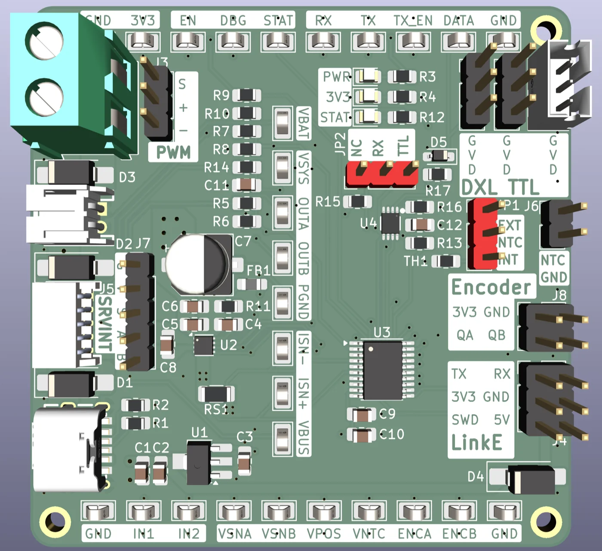

# OSC Dev V006 — Rev. B

> ⚠️ **Pre-fabrication / pre-bringup — placeholder document.**
> Rev. B has not been fabricated or validated yet. Firmware is still in development. Everything below describes the _intended_ design — pinouts, signal names, jumper behaviour, and component values may still change once the board is brought up.
> **Fabricate this at your own risk!**

See [CHANGELOG.md](CHANGELOG.md) for revision history.

OpenServoCore firmware development & validation board. CH32V006F8P6-based, designed to accept any gutted hobby servo (SG90, MG90, and similar) so firmware can be brought up and characterised against real motor / pot / encoder hardware.

Component sizing favours flexibility over board cost: 5 A / 40 V Schottky power-OR (SS54), 4 A peak motor driver (DRV8212P), 10 mΩ / 333 mW low-side current shunt. Edge test points expose every rail and signal of interest for scope probing.

## Overview

- **MCU** — CH32V006F8P6 (RISC-V, 48 MHz, 62 KB flash, 8 KB RAM).
- **Motor driver** — TI DRV8212PDSGR. H-bridge with IN1/IN2 PWM. 4 A peak, 1.76 A RMS continuous, VM 1.65–11 V.
- **LDO** — HT7533-1, 3.3 V logic rail.
- **UART buffer** — 74LVC2G241 for half-duplex DXL.
- **Current shunt** — 10 mΩ, 1%, 333 mW (RS1) on the low side.
- **Power input** — USB-C 5 V, 1S–2S LiPo (3.0–8.4 V) via JST-PH or screw terminal, or WCH-LinkE `+5V`. Any combination, OR'd through SS54s.
- **Debug** — WCH-LinkE over the CH32V006's 1-wire SWDIO.
- **Position feedback** — potentiometer (`VPOS`) and/or quadrature encoder (`QA` / `QB` on J8).
- **Temperature** — onboard NTC (TH1) or external NTC (J6), selected via JP1.

## Roles

The board is intentionally over-spec'd so the same hardware can fill three roles, switched in firmware:

1. **Firmware development & validation** — a gutted servo plugged into J5/J7, current/voltage telemetry on every rail, scope on the edge test points. Primary role.
2. **Servo / motor identification & calibration** — adapt firmware to unknown servos and clones. Two sub-modes:
   - _Servo ID_ via the PWM header (J3): drive a fully-assembled stock servo and characterise it end-to-end — positional accuracy, slew rate, error percentage on repeated sweep / return-to-centre tests, etc.
   - _Motor ID_ via the gutted-servo connector (J5/J7) using only the `MOT_A` / `MOT_B` leads, with an external encoder on J8: extract motor constants (`Kt`, `Ke`, R, L, viscous friction) by driving the bare motor and observing current and shaft velocity directly.
3. **High-precision feedback experiments** — alternate encoders on J8 (TIM2 quadrature _or_ ADC analog), e.g. a custom IR-quadrature flex PCB for backlash-compensation work, all without respinning a dev board.

## Connectors

Connector positions are visible in the front render above. All 2.54 mm pin headers are vertical through-hole.

### Power

The board has **four independent power inputs**, each gated by its own SS54 (5 A / 40 V Schottky) into a common `VSYS` rail. Any combination of sources may be plugged in simultaneously — the highest voltage wins, and back-feed between sources is blocked.

| Source                   | Connector    | Typical use                                                                                          |
| ------------------------ | ------------ | ---------------------------------------------------------------------------------------------------- |
| USB-C                    | `USB1`       | Quick smoke-test from a phone charger or laptop.                                                     |
| Battery (JST)            | `J1`         | Wired-up integration, untethered runs.                                                               |
| Battery (screw terminal) | `J2`         | Bench supply / variable voltage characterisation.                                                    |
| WCH-LinkE +5 V (`VPROG`) | `J4` (pin 6) | "Just plug in the debugger" — the LinkE powers the board over the same cable used to flash firmware. |

#### USB-C — USB1

Power-only USB-C input, 5 V (no D+/D−). Any USB-C source — phone charger, laptop, bench supply.

#### LiPo Battery — J1

JST-PH 2P horizontal connector. **1S–2S LiPo only (3.0–8.4 V).** The DRV8212P caps the safe motor rail at 11 V; 3S is not supported.

#### Screw Terminal — J2

5.08 mm 2P screw terminal on its own `VEXT` net with a dedicated SS54 — independent from `J1`'s `VBAT` net so a short on one connector won't pull down the other. Bench-friendly: sweep input voltage with a lab supply for characterisation. Same 1S–2S LiPo range as `J1`.

> **Note:** The fourth power input is the WCH-LinkE +5 V rail (`VPROG`) on **J4** pin 6 — see [Comms & debug → WCH-LinkE](#wch-linke--j4). A separate SS54 ORs `VPROG` into `VSYS`, so the LinkE alone can power the board for firmware-only sessions.

### Motor & sensing

#### PWM Servo — J3

Standard hobby PWM servo header (1×3, 2.54 mm). Drives a stock servo from `IN1` for the board's **identification / calibration role** — characterising motor constants, response, and clone-vs-spec deviations of unknown servos.

⚠️ **`V+` is `VSYS` directly, no protection or regulation.** Whatever you put on `J1`/`J2`/USB is what the attached servo sees. Don't plug a 4.8 V-rated micro servo into a 2S LiPo rail.

#### Gutted Servo Internals — J5 / J7

Two footprints for the same five nets (`+3V3` / `VPOS` / `MOT_A` / `MOT_B` / `GND`) — populate one for your wiring style:

- **J5** — JST-ZH 5P horizontal: cable-friendly for a gutted servo.
- **J7** — 1×5 pin header: breadboard-friendly.

Connects to the gutted servo's motor leads and potentiometer wiper. **Don't populate both** — the nets are shared.

#### Encoder — J8

External encoder input on a 2×2 pin header. `ENCA` / `ENCB` are pin-mapped to **both TIM2** (hardware quadrature counter) **and the ADC** on the MCU, so the same connector accepts:

- Digital quadrature encoders (magnetic, optical) — counted in hardware via TIM2.
- Analog / ADC-based encoders (sin-cos, ratiometric) — sampled directly.

Intended as the upgrade path for higher-precision position feedback (e.g. a custom IR-quadrature flex PCB) and for motor-speed feedback during identification runs — without needing a board respin.

#### External NTC — J6

1×2 pin header for an external NTC thermistor. Selected as the temperature source via **JP1** (see below).

### Comms & debug

#### WCH-LinkE — J4

2×3 pin header (2.54 mm) for the WCH-LinkE programmer / debugger. `SWD` is the CH32V006's single-wire debug pin. The `+5V` pin (replacing Rev. A's `nRST`) carries the LinkE's `VPROG` rail and **also feeds back into the on-board power-OR network** through an SS54 — so plugging in the LinkE alone is enough to bring the board up for firmware work.

- Row 1: TX, RX
- Row 2: +3V3, GND
- Row 3: SWD, +5V

#### DXL TTL Bus — J9 / J10 / J11

OpenServoCore uses **single-wire half-duplex UART (Dynamixel TTL)** as its physical bus. Two reasons:

- **Three wires only** (`GND` / `V+` / `DATA`) — the same pin count as the original 3-wire hobby-servo cable, so a stock SG90/MG90 cable is reused as-is when swapping the OEM control board for an OSC swap board.
- **Prior art.** Dynamixel TTL is a well-understood, well-documented bus with a mature protocol (Dynamixel 2.0). OSC copies the electrical and protocol layer rather than inventing a new one.

Three connectors share the same `GND` / `V+` / `DATA` net — pick whichever fits your wiring:

- **J9, J10** — 1×3 pin headers (breadboard / daisy-chain wiring).
- **J11** — JST-PH 3P vertical (cable connector).

The bus is designed to behave like a real Dynamixel daisy-chain: **the powered board feeds `VSYS` onto the `V+` pin to power downstream boards over the same cable.**

⚠️ **`V+` is `VSYS` directly, unprotected.** Anything you daisy-chain to the bus must tolerate the upstream board's full input voltage (up to 8.4 V at 2S full charge).

## Jumpers

### NTC Source Select — JP1

Selects which thermistor feeds `VNTC`. The center pin (`NTC`) is the common signal routed to the MCU; jump it to either side.

- `INT` ↔ `NTC`: use the onboard TH1.
- `NTC` ↔ `EXT`: use the external thermistor connected to J6.

### UART RX Route — JP2

Selects whether the MCU's `RX` pin is connected to the DXL buffer or floated. This exists so the WCH-LinkE's `TX` / `RX` pins on **J4** can be used as a regular UART (for `printf` / log output, host comms, etc.) without contention against the DXL buffer.

- `RX` ↔ `TTL`: connects `RX` to the 74LVC2G241 buffer output. Use this for normal **DXL bus operation**.
- `RX` ↔ `NC`: floats `RX`. Use this when you want the **LinkE's UART** to drive `RX` directly via J4 — otherwise the buffer would hold `RX` high and contend with the LinkE's `TX`.

## Test points

Probe pads line three edges of the board, grouped by rail family for easy scope hookup during firmware bringup. Each pad is labelled in silkscreen and visible in the front render.

### Top edge — digital / comms

| TP      | Description                                                                                      |
| ------- | ------------------------------------------------------------------------------------------------ |
| `+3V3`  | LDO output (HT7533-1).                                                                           |
| `EN`    | Motor-driver enable (DRV nSLEEP). Low = sleep, high = active. MCU-driven.                        |
| `DBG`   | Firmware-defined general-purpose debug line — typically used as a scope-correlated event marker. |
| `STAT`  | TIM1 PWM output to the STAT LED. Used to signal fault / debugging.                               |
| `RX`    | MCU UART RX.                                                                                     |
| `TX`    | MCU UART TX.                                                                                     |
| `TX_EN` | TX Enable. 74LVC2G241 buffer direction                                                           |
| `DATA`  | Buffered DXL bus                                                                                 |

### Vertical rail — motor control / analog

| TP     | Description                                                                      |
| ------ | -------------------------------------------------------------------------------- |
| `IN1`  | DRV IN1 — H-bridge PWM input 1.                                                  |
| `IN2`  | DRV IN2 — H-bridge PWM input 2.                                                  |
| `VSNA` | Divided sense of motor terminal `OUTA`.                                          |
| `VSNB` | Divided sense of motor terminal `OUTB`.                                          |
| `VPOS` | Servo potentiometer wiper voltage for position feedback.                         |
| `VNTC` | Thermistor divider output — source selected by JP1 (onboard TH1 or external J6). |
| `ENCA` | Quadrature channel A from J8. Routes to TIM2 and ADC.                            |
| `ENCB` | Quadrature channel B from J8. Routes to TIM2 and ADC.                            |

### Right column — power rails

| TP     | Description                                                                              |
| ------ | ---------------------------------------------------------------------------------------- |
| `VBAT` | Battery rail before the OR diodes.                                                       |
| `VSYS` | System voltage. Common rail after the 4-way SS54 OR. Feeds the motor driver and the LDO. |
| `OUTA` | Motor terminal A. DRV output, switches between 0 and `VSYS` at the PWM rate.             |
| `OUTB` | Motor terminal B.                                                                        |
| `PGND` | Post-shunt motor return. Sits at signal `GND` plus `I_motor × 10 mΩ`.                    |
| `ISN−` | Differential current-sense input, low side. ≈ `PGND`.                                    |
| `ISN+` | Differential current-sense input, high side. Sits ~`I × 10 mΩ` above `ISN−`.             |
| `VBUS` | USB-C 5 V (0 – 5 V). Pre-OR diode, useful to confirm USB delivery before the SS54 drop.  |

## Status LEDs

Three indicator LEDs are grouped in the upper-middle of the board.

| LED      | Color | Meaning           |
| -------- | ----- | ----------------- |
| **PWR**  | amber | VSYS present      |
| **3V3**  | green | 3.3 V rail up     |
| **STAT** | red   | MCU-driven status |

## Mechanical

- 4× M2 mounting holes (Ø2.2 mm) at the corners. The plated pads are tied to `GND` — handy for clipping a scope alligator ground without giving up a probe pad.
- Board outline visible in the renders above; dimensions match the OSC dev-board family.

## Programming

Use a **WCH-LinkE** with the 2×3 J4 header. The link uses the CH32V006's 1-wire protocol. `+5V` on J4 is _not_ used for programming — it's available as a 5 V passthrough rail. The WCH-LinkE also provides TX/RX for a UART passthrough; if you use it, set **JP2** to `RX ↔ NC` so the TTL buffer doesn't contend with the LinkE for `RX`.
