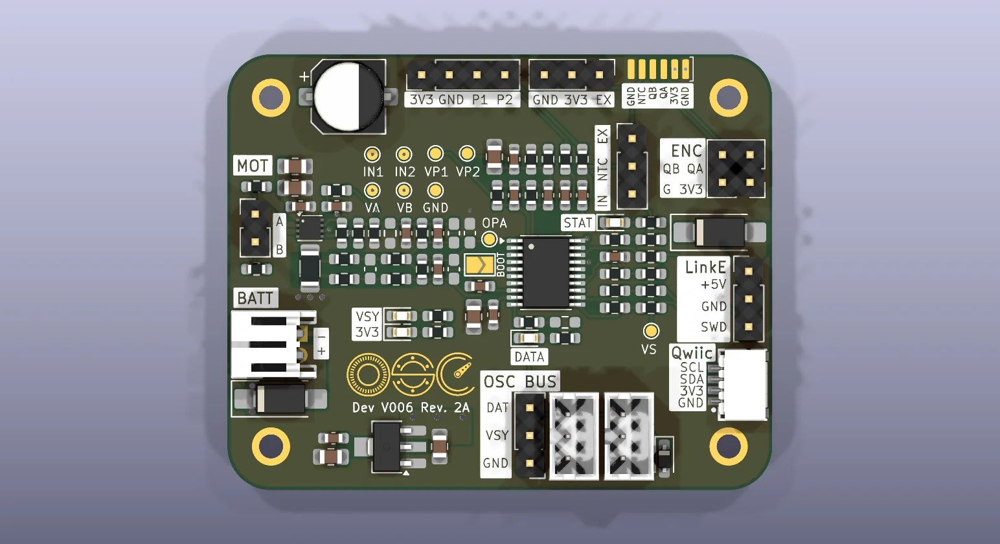

# OSC Dev V006 - Rev. 2A

> ⚠️ **Pre-fabrication / pre-bringup.**
> Rev. 2A has not been fabricated or validated yet. Everything below describes the design as it heads to fab. Pinouts, signal names, jumper behavior, and component values may still change during bringup.
> **Fabricate this at your own risk!**

See [CHANGELOG.md](CHANGELOG.md) for revision history.

This is the OpenServoCore firmware development and validation board. It is built around the CH32V006F8P6 and designed to accept any gutted hobby servo (SG90, MG90, and similar), so firmware can be brought up and characterized against real motor / pot / encoder hardware.

## Overview

- **MCU** - CH32V006F8P6 (RISC-V, 48 MHz, 62 KB flash, 8 KB RAM, TSSOP20).
- **Motor driver** - TI DRV8212PDSGR. H-bridge with IN1/IN2 PWM. 4 A peak, 1.76 A RMS continuous, VM 1.65-11 V.
- **Current sense** - 33 mΩ kelvin-connected low-side shunt feeding the MCU's on-chip op-amp. The op-amp is wired as a difference amplifier with G = 14.88 and a 0.52 V bias, so both current directions are visible. The whole network is 0.5 % / 25 ppm thin film.
- **LDO** - HT7533-1 for the 3.3 V logic rail. A ferrite bead (FB1) splits off `+3V3_DRV` for the motor driver logic supply.
- **Servo bus** - single-wire half-duplex UART (Dynamixel-TTL electrical layer), wired directly to the MCU pin. The Rev. B 74LVC2G241 buffer is gone. Direction control and RX timing are now handled in firmware.
- **Telemetry UART** - a dedicated one-pin UART bridged to the WCH-LinkE header. I use it to stream raw telemetry at the 20 kHz kernel rate for system identification and control loop characterization. It also works as plain `printf` logging. Either way it doesn't fight with the servo bus.
- **Qwiic** - SH 1.0 mm 4P I2C connector for an encoder module, either magnetic (I2C) or a regular quadrature encoder breakout.
- **Power input** - 1S-2S LiPo (3.0-8.4 V) via JST-PH, or the WCH-LinkE 5 V rail. Either or both, OR'd through SS54 Schottkys.
- **Debug** - WCH-LinkE over the CH32V006 1-wire SWDIO.
- **Position feedback** - potentiometer or analog magnetic encoder on J5, I2C encoder on J3, or ADC-sampled custom quadrature on J6.
- **Temperature** - onboard NTC (TH1) or external NTC (J7), selected with JP2.
- **Board** - 50 × 40 mm, 6-layer 1.6 mm (JLCPCB JLC06161H-3313 stackup), ENIG, via-in-pad.

### Changed from Rev. B

Rev. 2A is a pretty big respin. Here is what changed:

- The 74LVC2G241 UART buffer is deleted. The bus `DATA` line connects straight to the MCU through a 33 Ω series resistor, and RX timing moved fully into firmware.
- Current sense is reworked around the CH32V006's on-chip op-amp. Kelvin shunt, precision difference amplifier network, and a VREF bias for bidirectional current.
- USB-C and screw-terminal power inputs are dropped. Battery and LinkE 5 V remain.
- The PWM servo header is dropped. Qwiic (I2C) and a dedicated 20 kHz telemetry UART are added.
- The edge test-point pads are replaced by three GND probe points. Signals are probed at their silk-labeled component pads.
- 4 layers -> 6 layers, and all connectors are renumbered.

## MCU pinout

CH32V006F8P6, TSSOP20. The "Function used" column is what the board wires the pin for. Alternates come from the CH32V006 datasheet pin table.

| Pin | Port  | Net       | Function used                                                              |
| --- | ----- | --------- | -------------------------------------------------------------------------- |
| 1   | `PD4` | `OPA_OUT` | Op-amp output (`OPO0`). The same pin is ADC `A7`, which samples it.        |
| 2   | `PD5` | `VSNA`    | ADC `A5`, motor terminal A voltage sense (÷3 divider).                     |
| 3   | `PD6` | `VSNB`    | ADC `A6`, motor terminal B voltage sense (÷3 divider).                     |
| 4   | `PD7` | `RST`     | `nRST` from factory. After the option byte flip, it becomes the op-amp `+` input (`OPP1`) via JP1. See [First boot](#first-boot). |
| 5   | `PA1` | `VPOS`    | ADC `A1`, servo potentiometer wiper (RC-filtered).                         |
| 6   | `PA2` | `VNTC`    | ADC `A0`, NTC thermistor divider.                                          |
| 7   | -     | `GND`     | `VSS`.                                                                     |
| 8   | `PD0` | `OPA_N`   | Op-amp `-` input (`OPN1`), difference amplifier gain network.              |
| 9   | -     | `+3V3`    | `VDD`.                                                                     |
| 10  | `PC0` | `DATA`    | USART1 TX (remap), single-wire half-duplex servo bus.                      |
| 11  | `PC1` | `SDA`     | I2C SDA, Qwiic (J3).                                                       |
| 12  | `PC2` | `SCL`     | I2C SCL, Qwiic (J3).                                                       |
| 13  | `PC3` | `DRV_EN`  | GPIO to the DRV8212P nSLEEP. A 10K pulldown keeps the driver asleep at reset. |
| 14  | `PC4` | `TEL`     | USART2 TX (remap), telemetry UART to the LinkE header.                     |
| 15  | `PC5` | `DRV_IN2` | TIM1 CH2 (remap), H-bridge PWM.                                            |
| 16  | `PC6` | `DRV_IN1` | TIM1 CH3 (remap), H-bridge PWM.                                            |
| 17  | `PC7` | `STAT`    | STAT LED, active low. TIM1 CH4 capable for PWM patterns.                   |
| 18  | `PD1` | `SWDIO`   | 1-wire debug (100 Ω series to J2).                                         |
| 19  | `PD2` | `ENCB`    | Encoder B. ADC `A3`, analog quadrature sampling.                           |
| 20  | `PD3` | `ENCA`    | Encoder A. ADC `A4`, analog quadrature sampling.                           |

## Connectors

All 2.54 mm pin headers are vertical through-hole. Positions and pin-1 markings are visible in the front render above.

### Battery - J1

JST-PH 2P horizontal. **1S-2S LiPo only (3.0-8.4 V).** The DRV8212P caps the safe motor rail at 11 V, so 3S is not supported. This input is OR'd into `VSYS` through an SS54, so it coexists with LinkE power.

### WCH-LinkE - J2

2×3 pin header (2.54 mm) for the WCH-LinkE programmer / debugger.

| Pin | Silk  | Net       | Notes                                             |
| --- | ----- | --------- | ------------------------------------------------- |
| 1   | `5V`  | `VPROG`   | LinkE 5 V rail, OR'd into `VSYS` through an SS54. |
| 2   | `TX`  | `TEL_TX`  | LinkE TX, bridged to `TEL` through 100 Ω.         |
| 3   | `G`   | `GND`     |                                                   |
| 4   | `RX`  | `TEL_RX`  | LinkE RX, bridged to `TEL` through 1 K.           |
| 5   | `G`   | `GND`     |                                                   |
| 6   | `SWD` | `SWDIO`   | 1-wire debug.                                     |

Plugging in the LinkE alone is enough to power the board. Very handy for firmware-only sessions.

The telemetry line `TEL` is a single MCU pin (`PC4`) bridged to both LinkE TX and RX through series resistors. Telemetry goes out by default, and the LinkE can drive the pin for input without any rewiring. I use this line to stream raw telemetry at the 20 kHz kernel rate, per-tick current / position / duty samples straight off the control loop. This is how I do system identification, characterize the control loop, and plot response graphs on the host.

### Qwiic - J3

SH 1.0 mm 4P (GND / +3V3 / SDA / SCL), standard [Qwiic](https://www.sparkfun.com/qwiic) pinout, with 4K7 pull-ups on board.

This one is meant for an encoder module rather than generic sensors. Either an I2C magnetic encoder (MT6701 / AS5600 breakout) or a regular quadrature encoder adapter works. The board has no hardware quadrature counting (see J6), so Qwiic is the flexible stand-in for it.

### Motor - J4

1×2 pin header carrying `MOT_A` / `MOT_B` straight off the DRV8212P outputs. Through-hole, so the high-current path stays zero-via.

### Position - J5

1×3 pin header with `+3V3` / `GND` / `POT`. It takes either:

- The gutted servo's **potentiometer**. Excitation comes from `+3V3` and the wiper goes into `POT`. Excitation and ADC reference share the same rail, so the reading is ratiometric and supply drift cancels out.
- An **analog-output magnetic encoder** (e.g. MT6701 in ratiometric analog mode) as a drop-in pot replacement on the same three wires.

For a magnetic encoder, use either this connector (analog) or Qwiic (I2C).

### Encoder - J6

2×2 pin header. `+3V3` / `GND` on one row, `ENCA` / `ENCB` on the other, going into ADC channels `A4` / `A3`.

This is a future expansion connector for an ADC-sampled custom IR quadrature encoder, in the style of [ServoProject](https://github.com/adamb314/ServoProject). The analog A/B phases get oversampled and interpolated for sub-count resolution. Hardware quadrature counting is not possible here since `PD2` / `PD3` don't carry TIM2 CH1/CH2, so I never considered it. A digital encoder belongs on Qwiic instead.

### External NTC - J7

1×2 pin header for an external NTC thermistor. Select it as the temperature source with JP2.

### Servo TTL bus - J8 / J9 / J10

OpenServoCore talks over a single-wire half-duplex UART, the same electrical layer as Dynamixel TTL. Three wires only (`GND` / `V+` / `DATA`), the same pin count as a hobby servo cable. The wire protocol on top is **osc-native**, OSC's own break-framed protocol built for sub-$0.20 MCUs ([spec](../../../docs/osc-native-protocol.md)).

Three connectors share the same nets. Pick whichever fits your wiring:

- **J8** - 1×3 pin header for breadboard / daisy-chain wiring.
- **J9, J10** - JST-PH 3P vertical for cables.

The powered board feeds `VSYS` onto `V+` to power downstream boards over the same cable, just like a real Dynamixel daisy-chain. The `DATA` line has a PESD5V0L1BA ESD clamp (D6) and a DNP 10K pull-up footprint (R24) for single-device bench setups.

⚠️ **`V+` is `VSYS` directly, unprotected.** Anything you daisy-chain to the bus must tolerate the upstream board's full input voltage (up to 8.4 V at 2S full charge).

## Jumpers

### Bootstrap - JP1 (solder jumper)

This jumper bridges the op-amp `+` input network onto the shared `nRST` / `OPP1` pin (`PD7`). It ships open on fresh boards and gets closed as the last step of [first boot](#first-boot). Current sense is inactive until it is closed.

### NTC source select - JP2

1×3 pin header, silk `EX` / `NTC` / `IN`. The center pin is the common signal routed to the MCU. Jump it to either side:

- `NTC` ↔ `IN` uses the onboard TH1.
- `EX` ↔ `NTC` uses the external thermistor on J7.

## Current sense

Motor return current flows through RS1 (33 mΩ, 1 %, 1206) between `PGND` and `GND`. Net-tie kelvin taps at the pad midpoints feed the MCU's on-chip op-amp, wired as a four-resistor difference amplifier.

- **Gain**. Rf 6K4 / Rg 430 gives G = 14.88, which works out to about 491 mV/A at the ADC.
- **Bias**. The amplifier references `VREF` = 0.52 V (a 1K6/300 divider from `+3V3`), so negative current from regen or reversal is visible too. The usable range is roughly -1 A to +5.6 A.
- **Compensation**. 22 pF across each feedback arm, for a corner around 1.1 MHz.

All six network resistors are 0.5 % / 25 ppm thin film. Matching and drift are what limit accuracy here, and firmware can't compensate for either, so this is where the precision parts went.

A bunch of experiment footprints around this block ship unpopulated (DNP):

| Ref       | Value  | Purpose when fitted                                                 |
| --------- | ------ | ------------------------------------------------------------------- |
| `Cc3/Cc4` | 47 pF  | Stack on the 22 pF comp caps for a slower, quieter corner.          |
| `Ck1`     | 100 pF | Differential filter across the kelvin inputs.                       |
| `Rd3`     | 300    | Parallels Rd2, dropping `VREF` to 0.28 V for a near-unipolar range. |
| `RS2`     | 60 mΩ  | Parallel shunt stack (33∥60 ≈ 22 mΩ) for high-current work.         |
| `R24`     | 10K    | `DATA` bus pull-up for single-device bench setups.                  |

`Rk1` / `Rk2` (fitted 0 Ω) sit in series with the kelvin taps. They are swap points for gain-trim experiments.

## Other sensing

- **Motor terminal voltage**. `MOT_A` / `MOT_B` go through 20K/10K dividers (÷3, so 8.4 V lands comfortably inside the 3.3 V ADC range) with 100 pF filters, into ADC `A5` / `A6`.
- **Position**. The pot wiper goes through a 4K7 + 100 nF RC into ADC `A1`.
- **Temperature**. A 10K pull-up against a 10K / 3950K NTC (onboard or external, JP2 selects), into ADC `A0`.

## LEDs

| LED    | Color  | Meaning                                |
| ------ | ------ | -------------------------------------- |
| `VSYS` | yellow | System rail present.                   |
| `3V3`  | green  | Logic rail up.                         |
| `TEL`  | blue   | Telemetry UART activity (active low).  |
| `DAT`  | blue   | Servo bus activity (active low).       |
| `STA`  | red    | MCU-driven status (`PC7`, active low). |

## Test points & probing

Three GND probe points (TP1-TP3) are spread across the board for scope ground springs. The 4× M2 mounting holes (Ø2.2 mm) are also tied to `GND`, handy for an alligator clip. Signals are probed at their component pads, and the nets of interest are silk-labeled.

## Programming

Use a **WCH-LinkE** on J2. The link talks the CH32V006's 1-wire protocol on `SWD`. The LinkE's TX / RX connect to the telemetry UART (`TEL`), not the servo bus, so logging works during bus traffic with no jumper fiddling.

### First boot

The MCU's `nRST` and the op-amp `+` input share pin `PD7`. Fresh chips default to `nRST`, and the sense network sits near GND, which would hold the MCU in reset if it were connected. JP1 breaks the link until the option byte is flipped:

1. Make sure JP1 is open (no solder bridging the pads).
2. Program the USER option byte via the WCH-LinkE on J2 to set `nRST -> GPIO`.
3. Close JP1 with a small solder blob.

After this, the board runs as designed and current sense is live.
