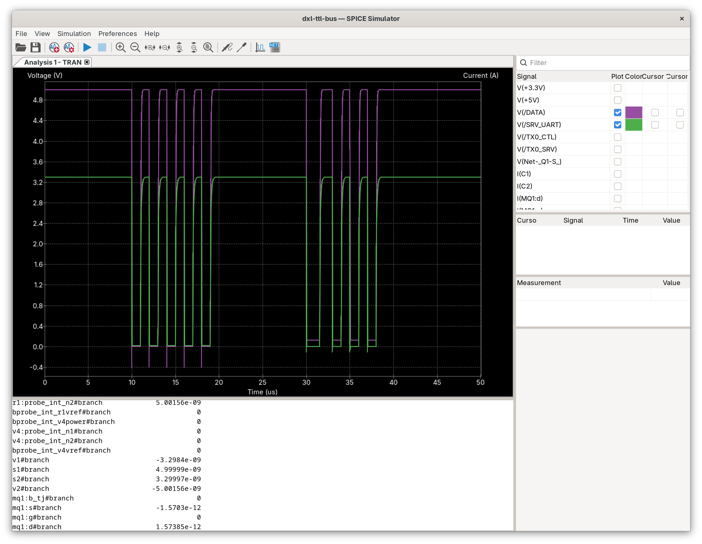

# DXL TTL Bus Level Shifter Simulation

Quick validation of N-MOSFET passive level shifter topology for Dynamixel TTL bus communication.

## Circuit Overview
- **MOSFET**: N-channel MOSFET (2N7002 or similar)
- **Pull-up resistors**: 49.9Ω on high voltage side, 10kΩ on low voltage side  
- **Voltage levels**: 5V ↔ 3.3V bidirectional level shifting

## Simulation Results
The simulation validates proper level translation between 5V and 3.3V domains with clean signal transitions. Shows expected voltage levels and switching behavior for TTL communication.

## Usage
This topology is used across multiple boards in the project for reliable voltage level translation in servo communication interfaces.

